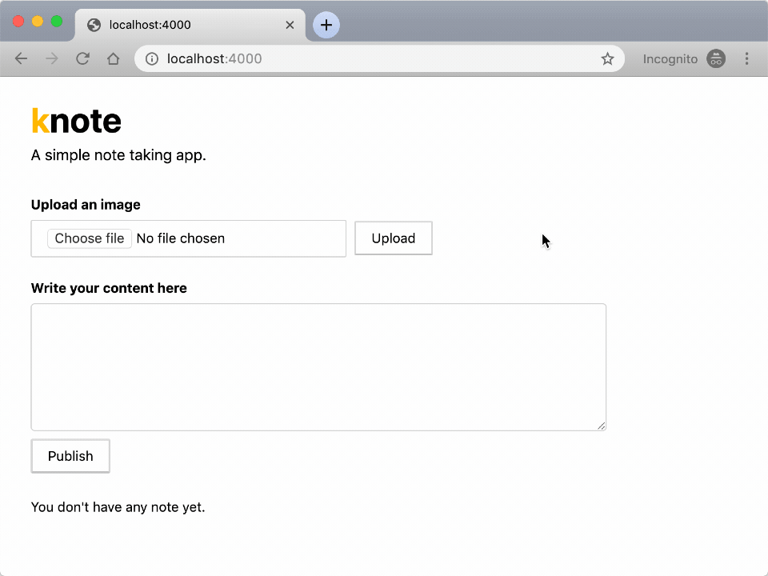
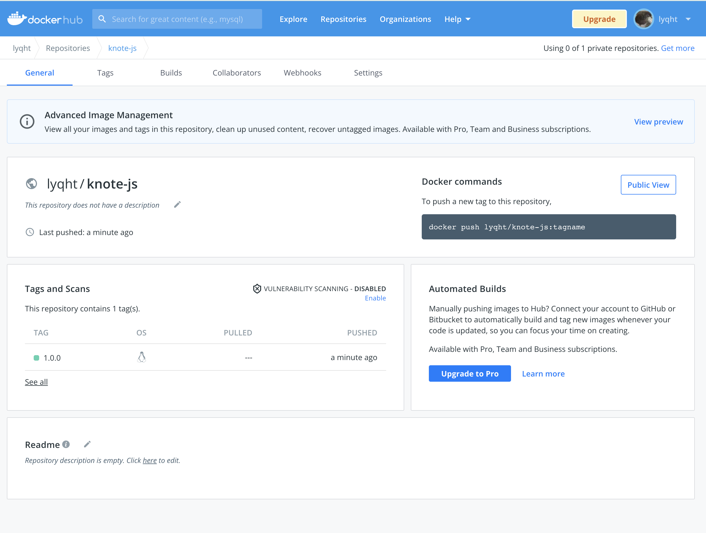

**TL;DR:** In chapter 1 of this mini-series, you'll learn how to create a note-taking app, containerize it, and upload it to Docker Hub.

So you want to get started with Kubernetes, but don't understand where to begin.

In order to get comfortable with a new tool, you need hands-on experience to use it effectively.

That's why this mini-series was created.

In this series, you'll learn to develop an app using Node.js, deploy it to a local Kubernetes cluster, scale the app, and deploy it to Amazon Web Services on a production-grade Kubernetes cluster.

And in this particular article, you'll cover the development of an app that you'll use throughout this series.

Here's how the development will unfold.

## Table of contents

1. [Knote — a note taking app](#knote-a-note-taking-app)
1. [Standard Express.js stack](#standard-express-js-stack)
1. [Connecting a database](#connecting-a-database)
1. [Saving and retrieving notes](#saving-and-retrieving-notes)
1. [Rendering Markdown to HTML](#rendering-markdown-to-html)
1. [Uploading pictures](#uploading-pictures)
1. [Deploying apps with containers](#deploying-apps-with-containers)
1. [Linux containers](#linux-containers)
1. [Containerising the app](#containerising-the-app)
1. [Running the container](#running-the-container)
1. [Uploading the container image to a container registry](#uploading-the-container-image-to-a-container-registry)
1. [Recap and next steps](#recap-and-next-steps)

## Knote — a note taking app

The essential ingredient to learn how to deploy and scale applications in Kubernetes is the application itself.

As you'll learn throughout this course, **mastering Kubernetes doesn't guarantee that you have zero incidents in production.**

If your application isn't designed to be resilient and observable, the risk of downtime in production is high — even if you're using Kubernetes.

Learning how to design and architect applications that leverage Kubernetes is crucial.

And that's exactly what you will learn in this this part of the course.

Now you will develop a small application for note taking similar to [Evernote](https://evernote.com/) and [Google Keep](https://www.google.com/keep/).

The app should let you:

1. record notes and
1. attach images to your notes

Notes aren't lost when the app is killed or stopped.

So you will use a database to store the content.

Here is how the app looks like:



The app is available [in this repository](https://github.com/learnk8s/knote-js/tree/master/01).

Go and check out the code with:

```terminal|command=1,2|title=bash
git clone https://github.com/learnk8s/knote-js
cd knote-js/01
```

You can install and start it with:

```terminal|command=1,2|title=bash
npm install
node index.js
```

The app will be hosted on <http://localhost:3000>.

Try to upload a picture — you should see a link inserted in the text box.

And when you publish the note, the picture should be displayed in the rendered note.

There're a couple of code choices worth discussing.

## Standard Express.js stack

[Express](https://expressjs.com/) and [Pug](https://pugjs.org/api/getting-started.html) are two popular choices when it comes to web servers and templating engines in Node.js.

This is how [a basic template for a Node.js project with Express and Pug](https://expressjs.com/en/guide/using-template-engines.html) looks like.

Now, create an `index.js` file with the following content:

```js|title=index.js
const path = require('path')
const express = require('express')

const app = express()
const port = process.env.PORT || 3000

async function start() {
  app.set('view engine', 'pug')
  app.set('views', path.join(__dirname, 'views'))
  app.use(express.static(path.join(__dirname, 'public')))

  app.listen(port, () => {
    console.log(`App listening on http://localhost:${port}`)
  })
}

start()
```

You also need a route and view to render the main page.

```js|title=index.js
async function start() {
  // ...
  app.get('/', (req, res) => res.render('index'))
}
```

> You can find the pug template [in this repository](https://github.com/learnk8s/knote-js/tree/master/01).

This code is adapted from a simple Express boilerplate app, so it doesn't do anything useful yet.

_To enhance it, let's learn to connect it to a database._

## Connecting a database

The database will store the notes.

_What database should you use? MySQL? Redis? Oracle?_

[MongoDB](https://www.mongodb.com/) is well-suited for your note-taking application because it's easy to set up and doesn't introduce the overhead of a relational database.

So, go on and install the MongoDB package:

```terminal|command=1|title=bash
npm install mongodb
```

Then add the following lines to the beginning of your `index.js` file:

```js|title=index.js
const MongoClient = require('mongodb').MongoClient
const mongoURL = process.env.MONGO_URL || 'mongodb://localhost:27017/dev'
```

Now your code needs to connect to the MongoDB server.

**You have to consider something important here.**

_When the app starts, it shouldn't crash because the database isn't ready too._

Instead, the app should keep retrying to connect to the database until it succeeds.

Kubernetes expects that application components can be started in _any order_. 

In order to achieve this, add the following function to your index.js file.

Add the following function to your `index.js` file:

```js|title=index.js
async function initMongo() {
  console.log('Initialising MongoDB...')
  let success = false
  while (!success) {
    try {
      client = await MongoClient.connect(mongoURL, {
        useNewUrlParser: true,
        useUnifiedTopology: true,
      })
      success = true
    } catch {
      console.log('Error connecting to MongoDB, retrying in 1 second')
      await new Promise(resolve => setTimeout(resolve, 1000))
    }
  }
  console.log('MongoDB initialised')
  return client.db(client.s.options.dbName).collection('notes')
}
```

With this function, the app will retry continuously to connect to the MongoDB database at the given URL. 

On a successful connection, it creates a collection called `notes`.

> MongoDB collections are like tables in relational databases — lists of items.

Now you have to call the above function inside the `start` function in your `index.js` file:

```js|highlight=2|title=index.js
async function start() {
  const db = await initMongo()
  // ...
}
```

Note how the `await` keyword blocks the execution of the app until the database is ready.

_The next step is to use the database._

## Saving and retrieving notes

When the main page of your app loads, two things happen:

- All the existing notes are displayed
- Users can create new notes through an HTML form

_Let's address the displaying of existing notes first._

You need a function to retrieve all notes from the database:

```js|title=index.js
async function retrieveNotes(db) {
  const notes = await db.find().toArray()
  const sortedNotes = notes.reverse()
  return sortedNotes
}
```

The route of the main page is `/`, so you have to add a corresponding route to your Express app that retrieves all the notes from the database and displays them:

Change the route inside the `start` function in your `index.js` file to:

```js|highlight=4|title=index.js
async function start() {
  // ...
  app.get('/', async (req, res) => {
    res.render('index', { notes: await retrieveNotes(db) })
  })
  // ...
}
```

The above handler calls the `retrieveNotes` function to get all the notes from the database and then passes them into the `index.pug` template.

_Next, let's address the creation of new notes._

First of all, you need a function that saves a single note in the database:

```js|title=index.js
async function saveNote(db, note) {
  await db.insertOne(note)
}
```

The form for creating notes is defined in the `index.pug` template.

Note that it handles both the creation of notes and uploading of pictures.

You should use [Multer](https://github.com/expressjs/multer), a middleware for multi-part form data, to handle the uploaded data.

Go on and install Multer:

```terminal|command=1|title=bash
npm install multer
```

And include it in your code:

```js|title=index.js
const multer = require('multer')
```

The form submits to the `/note` route, so you need to add this route to your app:

```js|title=index.js
async function start() {
  // ...
  app.post(
    '/note',
    multer().none(),
    async (req, res) => {
      if (!req.body.upload && req.body.description) {
        await saveNote(db, { description: req.body.description })
        res.redirect('/')
      }
    }
  )
  // ...
}
```

The above handler calls the `saveNote` function with the content of the text box, which causes the note to be saved in the database.

It then redirects to the main page, so that the newly created note appears immediately on the screen.

**Your app is functional now (although not yet complete)!**

You can already run your app at this stage.

But to do so, you need to start MongoDB as well.

You can install MongoDB following the instructions in the [official MongoDB documentation](https://docs.mongodb.com/manual/installation/).

Once MongoDB is installed, create an empty folder `data/db` and run the following to start a MongoDB server which points the db path to the folder that you just created:

```terminal|command=1|title=bash
npm run mongodb -- --dbpath ./data/db
```

Now run your app with:

```terminal|command=1|title=bash
npm run start
```

The app should connect to MongoDB and then listen for requests.

You can access your app on <http://localhost:3000>.

You should see the main page of the app.

Try to create a note — you should see it being displayed on the main page.

_Your app seems to work._

**But it's not complete yet.**

We have not fulfilled the following requirements:

- Display formatted markdown text (currently it only displays verbatim.)
- Uploading pictures

_Let's work on those next._

## Rendering Markdown to HTML

The Markdown notes should be rendered to HTML so that you can read them properly formatted.

[Marked](https://github.com/markedjs/marked) is an excellent engine for rendering Markdown to HTML.

As always, install the package first:

```terminal|command=1|title=bash
npm install marked
```

And import it in your `index.js` file:

```js|title=index.js
const { marked } = require('marked')
```

Then, change the `retrieveNotes` function as follows (changed lines are highlighted):

```js|highlight=3|title=index.js
async function retrieveNotes(db) {
  const notes = await db.find().toArray()
  const sortedNotes = notes.reverse()
  return sortedNotes.map(it => ({ ...it, description: marked(it.description) }))
}
```

The new code converts the description of all the notes to HTML before returning them.

Restart the app and access it on <http://localhost:3000>.

**All your notes should now be nicely formatted.**

_Let's tackle uploading files._

## Uploading pictures

When a user uploads a picture, the file should be saved on disk, and a link should be inserted in the text box.

This is similar to how adding pictures on StackOverflow works.

> Note that for this to work, the picture upload handler must have access to the text box — this is the reason that picture uploading and note creation are combined in the same form.

For now, the pictures will be stored on the local file system.

You will use Multer to handle the uploaded pictures.

Change the handler for the `/note` route as follows (changed lines are highlighted):

```js|highlight=5,10-16|title=index.js
async function start() {
  // ...
  app.post(
    '/note',
    multer({ dest: path.join(__dirname, 'public/uploads/') }).single('image'),
    async (req, res) => {
      if (!req.body.upload && req.body.description) {
        await saveNote(db, { description: req.body.description })
        res.redirect('/')
      } else if (req.body.upload && req.file) {
        const link = `/uploads/${encodeURIComponent(req.file.filename)}`
        res.render('index', {
          content: `${req.body.description} `,
          notes: await retrieveNotes(db),
        })
      }
    }
  )
  // ...
}
```

The new code saves uploaded pictures in the `public/uploads` folder in your app directory and inserts a link to the file into the text box.

Restart your app again and access it on <http://localhost:3000>.

Try to upload a picture — you should see a link inserted in the text box.

And when you publish the note, the picture should be displayed in the rendered note.

**Your app is feature complete now.**

> Note that you can find the complete code for the app in [in this repository](https://github.com/learnk8s/knote-js/tree/master/01).

You just created a simple note-taking app from scratch.

In the next section, you will learn how to package and run it as a Docker container.

## Deploying apps with containers

After creating your app, the next step is to deploy it.

There are a few standard ways of deploying an app.

1. You could deploy the app to a Platform as a Service (PaaS) like [Heroku](https://www.heroku.com/) and forget about the underlying infrastructure and dependencies.
1. Or you could do it the hard way and provision your own VPS, [install nvm](https://github.com/nvm-sh/nvm), create the appropriate users, configure Node.js as well as [PM2](http://pm2.keymetrics.io/) to restart the app when it crashes and [Nginx](https://www.nginx.com/) to handle TLS and path-based routing.

However, in recent times, there is a trend to package applications as Linux containers and deploy them to specialised container platforms.

_So what are containers?_

## Linux containers

Linux containers are often compared to shipping containers.

Shipping containers have a standard format, and they allow to isolate goods in one container from goods in another.

Goods that belong together are packed in the same container, goods that have nothing to do with each other are packed in separate containers.

_Linux containers are similar._

**However, the "goods" in a Linux container are processes and their dependencies.**

> Typically, a container contains a single process and its dependencies.

A container contains everything that is needed to run a process.

That means that you can run a process without having to install any dependency on your machine because the container has all you need.

Furthermore, the process in a container is isolated from everything else around it.

When you run a container, the process isn't aware of the host machine, and it believes that it's the only process running on your computer.

Of course, that isn't true.

Bundling dependency and isolating processes might remind you of virtual machines.

**However, containers are different from virtual machines.**

The process in a container still executes on the kernel of the host machine.

With virtual machines, you run an entire guest operating system on top of your host operating system, and the processes that you want to execute on top of that.

Containers are much more lightweight than virtual machines.

**How do containers work?**

The magic of containers comes from two features in the Linux kernel:

- Control groups (cgroups)
- Namespaces

These are low-level Linux primitives.

Control groups limit the resources a process can use, such as memory and CPU.

_You might want to limit your container to only use up to 512 MB of memory and 10% of CPU time._

Namespaces limit what a process can see.

_You might want to hide the file system of your host machine and instead provide an alternative file system to the container._

You can imagine that those two features are convenient for isolating process.

However, they are very low-level and hard to work with.

Developers created more and more abstractions to get around the sharp edges of cgroups and namespaces.

These abstractions resulted in container systems.

One of the first container systems was [LXC](https://linuxcontainers.org/).

But the container breakthrough came with [Docker](https://www.docker.com/) which was released in 2013.

> Docker isn't the only Linux container technology. There are other popular projects such as [rkt](https://github.com/rkt/rkt) and [containerd](https://containerd.io/).

In this section, you will package your application as a Docker container.

_Let's get started!_

## Containerising the app

First of all, you have to install the Docker Community Edition (CE).

You can follow the instructions in the [official Docker documentation](https://docs.docker.com/install/).

> If you're on Windows, you can [follow our handy guide on how to install Docker on Windows](https://learnk8s.io/installing-docker-kubernetes-windows).

You can verify that Docker is installed correctly with the following command:

```terminal|command=1|title=bash
docker run hello-world

Hello from Docker!
This message shows that your installation appears to be working correctly.
```

**You're now ready to build Docker containers.**

Docker containers are built from Dockerfiles.

A Dockerfile is like a recipe — it defines what goes in a container.

A Dockerfile consists of a sequence of commands.

You can find the full list of commands in the [Dockerfile reference](https://docs.docker.com/engine/reference/builder/).

Here is a Dockerfile that packages your app into a container image:

```docker|title=Dockerfile
FROM node:12.0-slim
COPY . .
RUN npm install
CMD [ "node", "index.js" ]
```

Go on and save this as `Dockerfile` in the root directory of your app.

The above Dockerfile includes the following commands:

- [`FROM`](https://docs.docker.com/engine/reference/builder/#from) defines the base layer for the container, in this case, a version of Ubuntu with Node.js installed
- [`COPY`](https://docs.docker.com/engine/reference/builder/#copy) copies the files of your app into the container
- [`RUN`](https://docs.docker.com/engine/reference/builder/#run) executes `npm install` inside the container
- [`CMD`](https://docs.docker.com/engine/reference/builder/#cmd) defines the command that should be executed when the container starts

You can now build a container image from your app with the following command:

```terminal|command=1|title=bash
docker build -t knote .
```

Note the following about this command:

- `-t knote` defines the name ("tag") of your container — in this case, your container is just called `knote`
- `.` is the location of the Dockerfile and application code — in this case, it's the current directory

The command executes the steps outlined in the `Dockerfile`, one by one:

```animation
{
  "description": "Layers in Docker images",
  "animation": "assets/layers.svg",
  "fallback": "assets/layers-fallback.svg"
}
```

**The output is a Docker image.**

_What is a Docker image?_

A Docker image is an archive containing all the files that go in a container.

You can create many Docker containers from the same Docker image:

```animation
{
  "description": "Relationship between Dockerfiles, images and containers",
  "animation": "assets/dockerfile-image-container.svg",
  "fallback": "assets/docker-image-container-fallback.svg"
}
```

> Don't believe that Docker images are archives? Save the image locally with `docker save knote > knote.tar`, then you can run `tar -tf knote.tar` to inspect it.

You can list all the images on your system with the following command:

```terminal|command=1|title=bash
docker images
REPOSITORY    TAG         IMAGE ID         CREATED            SIZE
knote         latest      dc2a8fd35e2e     30 seconds ago     165MB
node          12-slim     d9bfca6c7741     2 weeks ago        150MB
```

You should see the `knote` image that you built.

You should also see the `node:12-slim` which is the base layer of your `knote` image — it is just an ordinary image as well, and the `docker run` command downloaded it automatically from Docker Hub.

> Docker Hub is a container registry — a place to distribute and share container images.

_You packaged your app as a Docker image — let's run it as a container._

## Running the container

Remember that your app requires a MongoDB database.

In the previous section, you installed MongoDB on your machine and ran it with the `mongod` command.

You could do the same now.

_But guess what: you can run MongoDB as a container too._

MongoDB is provided as a Docker image named [`mongo`](https://hub.docker.com/_/mongo?tab=description) on Docker Hub.

_You can run MongoDB without actually "installing" it on your machine._

You can run it with `docker run mongo`.

**But before you do that, you need to connect the containers.**

The `knote` and `mongo` cointainers should communicate with each other, but they can do so only if they are on the same [Docker network](https://docs.docker.com/network/).

So, create a new Docker network as follows:

```terminal|command=1|title=bash
docker network create knote
```

**Now you can run MongoDB with:**

```terminal|command=1-4|title=bash
docker run \
  --name=mongo \
  --rm \
  --network=knote mongo
```

Note the following about this command:

- `--name` defines the name for the container — if you don't specify a name explicitly, then a name is generated automatically
- `--rm` automatically cleans up the container and removes the file system when the container exits
- `--network` represents the Docker network in which the container should run — when omitted, the container runs in the default network
- `mongo` is the name of the Docker image that you want to run

Note that the `docker run` command automatically downloads the `mongo` image from Docker Hub if it's not yet present on your machine.

MongoDB is now running.

**Now you can run your app as follows:**

```terminal|command=1-7|title=bash
docker run \
  --name=knote \
  --rm \
  --network=knote \
  -p 3000:3000 \
  -e MONGO_URL=mongodb://mongo:27017/dev \
  knote
```

Note the following about this command:

- `--name` defines the name for the container
- `--rm` automatically cleans up the container and removes the file system when the container exits
- `--network` represents the Docker network in which the container should run
- `-p 3000:3000` publishes port 3000 of the container to port 3000 of your local machine. That means, if you now access port 3000 on your computer, the request is forwarded to port 3000 of the Knote container. You can use the forwarding to access the app from your local machine.
- `-e` sets an environment variable inside the container

Regarding the last point, remember that your app reads the URL of the MongoDB server to connect to from the `MONGO_URL` environment variable.

If you look closely at the value of `MONGO_URL`, you see that the hostname is `mongo`.

_Why is it `mongo` and not an IP address?_

`mongo` is precisely the name that you gave to the MongoDB container with the `--name=mongo` flag.

If you named your MongoDB container `foo`, then you would need to change the value of `MONGO_URL` to `mongodb://foo:27017`.

**Containers in the same Docker network can talk to each other by their names.**

This is made possible by a built-in DNS mechanism.

_You should now have two containers running on your machine, `knote` and `mongo`._

You can display all running containers with the following command:

```terminal|command=1|title=bash
docker ps
CONTAINER ID    IMAGE    COMMAND                  PORTS                    NAMES
2fc0a10bf0f1    knote    "node index.js"          0.0.0.0:3001->3000/tcp   knote
41b50740a920    mongo    "docker-entrypoint.s…"   27017/tcp                mongo
```

Great!

_It's time to test your application!_

Since you published port 3000 of your container to port 3000 of your local machine, your app is accessible on <http://localhost:3000>.

Go on and open the URL in your web browser.

**You should see your app!**

Verify that everything works as expected by creating some notes with pictures.

When you're done experimenting, stop and remove the containers as follows:

```terminal|command=1,2|title=bash
docker stop mongo knote
docker rm mongo knote
```

## Uploading the container image to a container registry

Imagine you want to share your app with a friend — how would you go about sharing your container image?

Sure, you could save the image to disk and send it to your friend.

_But there is a better way._

When you ran the MongoDB container, you specified its Docker Hub ID (`mongo`), and Docker automatically downloaded the image.

_You could create your images and upload them to DockerHub._

If your friend doesn't have the image locally, Docker automatically pulls the image from DockerHub.

> There exist other public container registries, such as [Quay](https://quay.io/) — however, Docker Hub is the default registry used by Docker.

**To use Docker Hub, you first have to [create a Docker ID](https://hub.docker.com/signup).**

A Docker ID is your Docker Hub username.

Once you have your Docker ID, you have to authorise Docker to connect to the Docker Hub account:

```terminal|command=1|title=bash
docker login
```

Before you can upload your image, there is one last thing to do.

**Images uploaded to Docker Hub must have a name of the form `username/image:tag`:**

- `username` is your Docker ID
- `image` is the name of the image
- `tag` is an optional additional attribute — often it is used to indicate the version of the image

To rename your image according to this format, run the following command:

```terminal|command=1|title=bash
docker tag knote <username>/knote-js:1.0.0
```

> Please replace `<username>` with your Docker ID, e.g. `lyqht/knote-js:1.0.0`.

**Now you can upload your image to Docker Hub:**

```terminal|command=1|title=bash
docker push <username>/knote-js:1.0.0
```

Your image is now publicly available as `<username>/knote-js:1.0.0` on Docker Hub and everybody can download and run it.

You can find the one you uploaded at https://hub.docker.com/repository/docker/your_username/knote-js. 

This is how an example of the uploaded image on DockerHub look like:



To verify this, you can re-run your app, but this time using the new image name.

```terminal|command=1-5,6-12|title=bash
docker run \
  --name=mongo \
  --rm \
  --network=knote \
  mongo
docker run \
  --name=knote \
  --rm \
  --network=knote \
  -p 3000:3000 \
  -e MONGO_URL=mongodb://mongo:27017/dev \
  <username>/knote-js:1.0.0
```

Everything should work exactly as before.

**Note that now everybody in the world can run your application by executing the above two commands.**

And the app will run on their machine precisely as it runs on yours — without installing any dependencies.

_This is the power of containerisation!_

Once you're done testing your app, you can stop and remove the containers with:

```terminal|command=1,2|title=bash
docker stop mongo knote
docker rm mongo knote
```

Well done for making it this far!

## Recap and next steps

Here's a recap of what you've done so far.

1. You created an application using Express.js and MongoDB.
1. You packaged the app as a container using Docker.
1. You uploaded the container to Docker Hub — a container registry.
1. You ran the app and the databases locally using Docker.

[In the next section, you will learn how to run your containerised application on Kubernetes!](https://learnk8s.io/deploying-nodejs-kubernetes)
