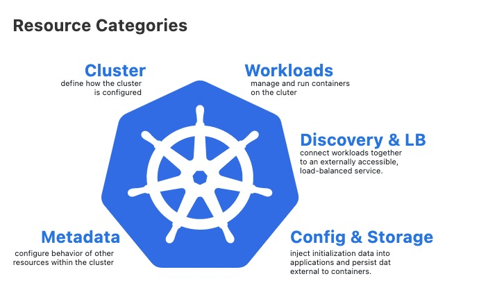
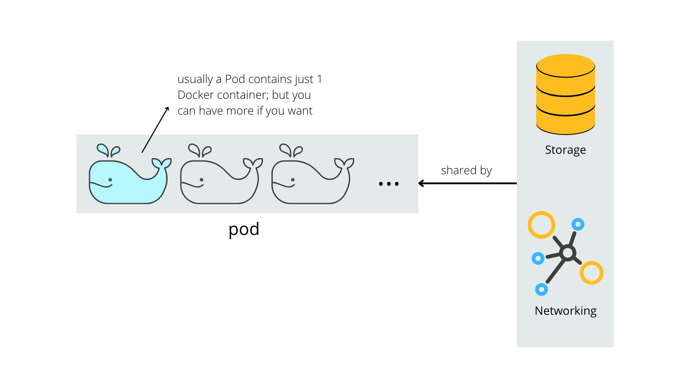

**TL;DR:** In this chapter, you'll learn how to create a local Kubernetes cluster and deploy an application.

If you use Docker containers and wish to deploy your app into production, you might have a few options.

You could:

- Run the container in the server manually with a docker run.
- Use a tool such as docker-compose to run and manage several containers at the same time.
- Or you could use a container orchestrator — a tool designed to manage and run containers at scale.

In this chapter, you will learn how to use Kubernetes (the most popular container orchestrator) to deploy your Node.js apps as Docker containers.

To demonstrate, we're going to deploy an app called Knote on a Kubernetes cluster.

The application comes already prepackaged as a Docker container. If you wish to learn how to build your own, you might want to check out this other article that goes into [how to design a Node.js application that can be containeraised.](https://learnk8s.io/spring-boot-kubernetes-guide)

Here's how you're going to proceed.

## Table of contents

1. [Deploying containerised applications](#deploying-containerised-applications)
1. [Container orchestrators](#container-orchestrators)
1. [Creating a local Kubernetes cluster](#creating-a-local-kubernetes-cluster)
1. [Kubernetes resources](#kubernetes-resources)
1. [The application](#the-application)
1. [Defining a Deployment](#defining-a-deployment)
1. [Defining a Service](#defining-a-service)
1. [Defining the database tier](#defining-the-database-tier)
1. [Deploying the application](#deploying-the-application)
1. [Recap and next steps](#recap-and-next-steps)

## Deploying containerised applications

There're several services where you can deploy Docker containers, for example, [AWS Elastic Beanstalk](https://aws.amazon.com/elasticbeanstalk/) or [Azure App Service](https://azure.microsoft.com/en-in/services/app-service/).

Those services are excellent if you wish to deploy a single or a small number of containers.

However, when you're building production-grade applications, it's common to have a large number of components that are all connected.

This is especially true if you follow the [microservices](https://microservices.io/) pattern.

Each component, or "microservice", should be scalable independently.

Solutions such as AWS Elastic Beanstalk and Azure App Service aren't designed to run those kinds of workloads.

_So how do you run complex containerised applications?_

With a container orchestrator.

## Container orchestrators

Container orchestrators are designed to run complex applications with large numbers of scalable components.

They work by inspecting the underlying infrastructure and determining the best server to run each container.

They can scale to thousands of computers and tens of thousands of containers and still work efficiently and reliably.

You can imagine a container orchestrator as a highly-skilled Tetris player.

Containers are the blocks, servers are the boards, and the container orchestrator is the player.

```animation
{
  "description": "Kubernetes is the best tetris player",
  "animation": "assets/tetris.svg",
  "fallback": "assets/tetris-fallback.svg"
}
```

Some existing container orchestrators include [Apache Mesos](http://mesos.apache.org/), [Hashicorp Nomad](https://www.nomadproject.io/), and [Kubernetes](https://kubernetes.io/).

_So which one should you choose?_

**It's not a fair fight.**

Kubernetes is the de-facto standard when it comes to orchestrating containers at a large scale.

Have a look at this Google Trends chart:

```animation
{
  "description": "Popular orchestrators",
  "animation": "assets/chart.svg",
  "fallback": "assets/chart-fallback.svg"
}
```

Popularity is not the only factor, though.

Kubernetes is:

1. **Open-source:** you can download and use it without paying any fee. You're also encouraged to contribute to the official project with bug fixes and new features
1. **Battle-tested:** there're plenty of examples of companies running it in production. There's also [a website where you can learn from the mistake of others](https://k8s.af/).
1. **Well-looked-after:** Redhat, Google, Microsoft, IBM, Cisco are only a few of the companies that have heavily invested in the future of Kubernetes by creating managed services, contributing to upstream development and offering training and consulting.

Kubernetes is an excellent choice to deploy your containerised application.

_But how do you do that?_

It all starts by creating a Kubernetes cluster.

## Creating a local Kubernetes cluster

There are several ways to create a Kubernetes cluster:

- Using a managed Kubernetes service like [Google Kubernetes Service (GKE)](https://cloud.google.com/kubernetes-engine/), [Azure Kubernetes Service (AKS)](https://docs.microsoft.com/en-us/azure/aks/), or [Amazon Elastic Kubernetes Service (EKS)](https://aws.amazon.com/eks/)
- Installing Kubernetes yourself on cloud or on-premises infrastructure with a Kubernetes installation tool like [kubeadm](https://kubernetes.io/docs/setup/production-environment/tools/kubeadm/create-cluster-kubeadm/) or [kops](https://github.com/kubernetes/kops)
- Creating a Kubernetes cluster on your local machine with a tool like [Minikube](https://kubernetes.io/docs/setup/learning-environment/minikube/), [MicroK8s](https://microk8s.io/), or [k3s](https://k3s.io/)

**In this section, you are going to use Minikube.**

Minikube creates a single-node Kubernetes cluster running in a virtual machine.

> A Minikube cluster is only intended for testing purposes, not for production. Later in this course, you will create an Amazon EKS cluster, which is suited for production.

**Before you install Minikube, you have to [install kubectl](https://kubernetes.io/docs/tasks/tools/install-kubectl/).**

kubectl is the primary Kubernetes CLI — you use it for all interactions with a Kubernetes cluster, no matter how the cluster was created.

**Once kubectl is installed, go on and [install Minikube](https://kubernetes.io/docs/tasks/tools/install-minikube/).**

> If you're on Windows, you can [follow our handy guide on how to install Minikube on Windows](https://learnk8s.io/installing-docker-kubernetes-windows) and if you have issues, [you might find this instructions relevant.](https://gist.github.com/danielepolencic/bdd5d8f7265b849b38cb5f8513a379d8)

With Minikube installed, you can create a cluster as follows:

```terminal|command=1|title=bash
minikube start --vm
```

The command creates a virtual machine and installs Kubernetes.

_Starting the virtual machine and cluster may take a couple of minutes, so please be patient!_

When the command completes, you can verify that the cluster is created with:

```terminal|command=1|title=bash
kubectl cluster-info
```

You have a fully-functioning Kubernetes cluster on your machine now.

_Time to learn about some fundamental Kubernetes concepts._

## Kubernetes resources

**Kubernetes has a declarative interface.**

In other words, you describe how you want the deployment of your application to look like, and Kubernetes figures out the necessary steps to reach this state.

The "language" that you use to communicate with Kubernetes consists of so-called Kubernetes resources.

There are many different Kubernetes resources — each is responsible for a specific aspect of your application. 

Here is a high level overview of the 5 categories of Kubernetes resources.

> You can find the full list of Kubernetes resources in the [Kubernetes API reference](https://kubernetes.io/docs/reference/generated/kubernetes-api/v1.20/).



Kubernetes resources are defined in YAML files and submitted to the cluster through the Kubernetes HTTP API. 

These files are referred as Kubernetes resource definitions, and are also sometimes called "resource manifests" or "resource configurations".

As soon as Kubernetes receives your resource definitions, it takes the necessary steps to reach the target state.

Similarly, to query the state of your applications, you retrieve Kubernetes resources through the Kubernetes HTTP API.

In practice, you do all these interactions with kubectl - your primary client for the Kubernetes API.

**It's time to experience Kubernetes first-hand.**

The resources that you will use are the [Deployment](https://kubernetes.io/docs/reference/generated/kubernetes-api/v1.20/#deployment-v1-apps) and the [Service](https://kubernetes.io/docs/reference/generated/kubernetes-api/v1.20/#service-v1-core).

Let's have a look at the app.

## The application

The application that you will deploy on Kubernetes is the following:


The application is made of two parts:

1. A front-end written in Node.js and Express.
1. A MongoDB to persist the data.

The application is already packaged as a container and it's available from Docker Hub as `learnk8s/knote-js:1.0.0`.

If you want to learn how to develop and package applications in container, you should check out [the previous chapter in this series.](https://learnk8s.io/developing-and-packaging-nodejs-docker)

Here's a quick refresher on what happened in the previous chapter.

1. You created a note-taking application using Express.js and MongoDB.
2. You ran the app and the databases locally using Docker.
3. You also packaged the app as a container using Docker.
4. Finally, you uploaded the container to Docker Hub — a container registry.

In the remainder of this chapter, you will define a set of Kubernetes resources that describe your application, and in the end, you will submit them to your Kubernetes cluster.

The completed code for all the tutorials in this series can be found [in this repository](https://github.com/learnk8s/knote-js/tree/master).

## Defining a Deployment

First of all, create a folder named `kube` in your application directory:

```terminal|command=1|title=bash
mkdir kube
```

The purpose of this folder is to hold all the Kubernetes resource definition YAML files that you will create.

> It's a [best practice](https://kubernetes.io/docs/concepts/cluster-administration/manage-deployment/#organizing-resource-configurations) to group all resource definitions for an application in the same folder because this allows to submit them to the cluster with a single command.

The first Kubernetes resource is a [Deployment](https://kubernetes.io/docs/reference/generated/kubernetes-api/v1.20/#deployment-v1-apps).

A Deployment creates containers and ensures that they are up and running.

Here is the definition of a Deployment for your Knote app:

```yaml|title=kube/knote.yaml
apiVersion: apps/v1
kind: Deployment
metadata:
  name: knote
spec:
  replicas: 1
  selector:
    matchLabels:
      app: knote
  template:
    metadata:
      labels:
        app: knote
    spec:
      containers:
        - name: app
          image: learnk8s/knote-js:1.0.0
          ports:
            - containerPort: 3000
          env:
            - name: MONGO_URL
              value: mongodb://mongo:27017/dev
          imagePullPolicy: Always
```

_That looks complicated, but we will break it down and explain it in detail._

For now, save the above content in a file named `knote.yaml` in the `kube` folder.

**You must be wondering how you can you find out about the structure of a Kubernetes resource.**

The answer is, in the [Kubernetes API reference](https://kubernetes.io/docs/reference/generated/kubernetes-api/v1.20/).

The Kubernetes API reference contains the specification for every Kubernetes resource, including all the available fields, their data types, default values, required fields, and so on.

Here is the specification of the [Deployment](https://kubernetes.io/docs/reference/generated/kubernetes-api/v1.20/#deployment-v1-apps) resource.

_If you prefer to work in the command-line, there's an even better way._

The `kubectl explain` command can print the specification of every Kubernetes resource directly in your terminal:

```terminal|command=1|title=bash
kubectl explain deployment
```

The command outputs exactly the same information as the web-based API reference.

To drill down to a specific field use:

```terminal|command=1|title=bash
kubectl explain deployment.spec.replicas
```

**Now that you know how to look up the documentation of Kubernetes resources, let's turn back to the Deployment.**

The first four lines define: 

- The type of resource (Deployment).
- The version of this resource type (`apps/v1`). 
- The name of this specific resource (`knote`).

```yaml|highlight=1-4|title=kube/knote.yaml
apiVersion: apps/v1
kind: Deployment
metadata:
  name: knote
spec:
  replicas: 1
  selector:
    matchLabels:
      app: knote
  template:
    metadata:
      labels:
        app: knote
    spec:
      containers:
        - name: knote
          image: learnk8s/knote-js:1.0.0
          ports:
            - containerPort: 3000
          env:
            - name: MONGO_URL
              value: mongodb://mongo:27017/dev
          imagePullPolicy: Always
```

Next, you declare the desired number of replicas of your container:

```yaml|highlight=6|title=kube/knote.yaml
apiVersion: apps/v1
kind: Deployment
metadata:
  name: knote
spec:
  replicas: 1
  selector:
    matchLabels:
      app: knote
  template:
    metadata:
      labels:
        app: knote
    spec:
      containers:
        - name: knote
          image: learnk8s/knote-js:1.0.0
          ports:
            - containerPort: 3000
          env:
            - name: MONGO_URL
              value: mongodb://mongo:27017/dev
          imagePullPolicy: Always
```

In Kubernetes, usually we talk about Pods rather than containers.

**So what is a Pod?**

A Pod is a wrapper around one or more containers.

A Pod often contains only a single container — however, for advanced use cases, a Pod may contain _multiple_ containers.



If a Pod contains multiple containers, they are treated by Kubernetes as a unit — this means that they will be started, executed and stopped together on the same node.

A Pod is also the _smallest unit of deployment_ in Kubernetes. Hence usually you never work with containers directly, but rather with Pods - the wrappers of those containers.

Technically, a [Pod](https://kubernetes.io/docs/reference/generated/kubernetes-api/v1.20/#pod-v1-core) is a Kubernetes resource, like a Deployment or Service.

**Let's turn back to the Deployment resource.**

The next part ties together the Deployment resource with the Pod replicas:

```yaml|highlight=7-13|title=kube/knote.yaml
apiVersion: apps/v1
kind: Deployment
metadata:
  name: knote
spec:
  replicas: 1
  selector:
    matchLabels:
      app: knote
  template:
    metadata:
      labels:
        app: knote
    spec:
      containers:
        - name: knote
          image: learnk8s/knote-js:1.0.0
          ports:
            - containerPort: 3000
          env:
            - name: MONGO_URL
              value: mongodb://mongo:27017/dev
          imagePullPolicy: Always
```

The `template.metadata.labels` field defines a label for the Pods that wrap your Knote container (`app: knote`).

The `selector.matchLabels` field selects those Pods with a `app: knote` label to belong to this Deployment resource.

> Note that there must be at least one shared label between these two fields.

The next part in the Deployment defines the actual container that you want to run:

```yaml|highlight=15-23|title=kube/knote.yaml
apiVersion: apps/v1
kind: Deployment
metadata:
  name: knote
spec:
  replicas: 1
  selector:
    matchLabels:
      app: knote
  template:
    metadata:
      labels:
        app: knote
    spec:
      containers:
        - name: knote
          image: learnk8s/knote-js:1.0.0
          ports:
            - containerPort: 3000
          env:
            - name: MONGO_URL
              value: mongodb://mongo:27017/dev
          imagePullPolicy: Always
```

It defines the following things:

- A name for the container (`knote`)
- The name of the Docker image (`learnk8s/knote-js:1.0.0`)
- The port that the container listens on (3000)
- An environment variable (`MONGO_URL`) that will be made available to the process in the container

The above arguments should look familiar to you: you used similar ones when you ran your app with `docker run` in the previous section.

That's not a coincidence.

When you submit a Deployment resource to the cluster, you can imagine Kubernetes executing `docker run` and launching your container in one of the computers.

The container specification also defines an `imagePullPolicy` of `Always` — the instruction forces the Docker image to be downloaded, even if it was already downloaded.

A Deployment defines how to run an app in the cluster, but it doesn't make it available to other apps.

_To expose your app, you need a Service._

## Defining a Service

A Service resource makes Pods accessible to other Pods or users outside the cluster.

Without a Service, a Pod cannot be accessed at all.

A Service forwards requests to a set of Pods:


In this regard, a Service is akin to a load balancer.

Now, let's add a Service resource definition to make your Knote Pod accessible from outside the cluster. 

We will add this resource definition to the existing YAML file:

```yaml|highlight=1-12|title=kube/knote.yaml
apiVersion: v1
kind: Service
metadata:
  name: knote
spec:
  selector:
    app: knote
  ports:
    - port: 80
      targetPort: 3000
  type: LoadBalancer
---
apiVersion: apps/v1
kind: Deployment
metadata:
  name: knote
spec:
  replicas: 1
  selector:
    matchLabels:
      app: knote
  template:
    metadata:
      labels:
        app: knote
    spec:
      containers:
        - name: knote
          image: learnk8s/knote-js:1.0.0
          ports:
            - containerPort: 3000
          env:
            - name: MONGO_URL
              value: mongodb://mongo:27017/dev
          imagePullPolicy: Always
```

Notice that the Service and Deployment resource definitions are together in the same file, and they are separated by the three dashes on line 12.

> Again, to find out about the available fields of a Service, look it up [in the API reference](https://kubernetes.io/docs/reference/generated/kubernetes-api/v1.20/#service-v1-core), or, even better, use `kubectl explain service`.

**Let's break down the Service resource.**

It consists of three crucial parts.

The first part is the selector:

```yaml|highlight=6-7|title=kube/knote.yaml
apiVersion: v1
kind: Service
metadata:
  name: knote
spec:
  selector:
    app: knote
  ports:
    - port: 80
      targetPort: 3000
  type: LoadBalancer
```

It selects the Pods to expose according to their labels.

In this case, all Pods that have a label of `app: knote` will be exposed by the Service.

Note how this label corresponds exactly to what you specified for the Pods in the Deployment resource:

```yaml|highlight=9-10|title=kube/knote.yaml
apiVersion: apps/v1
kind: Deployment
metadata:
  name: knote
spec:
  # ...
  template:
    metadata:
      labels:
        app: knote
    # ...
```

It is this label that ties your Service to your Deployment resource.

The next important part is the port:

```yaml|highlight=8-10|title=kube/knote.yaml
apiVersion: v1
kind: Service
metadata:
  name: knote
spec:
  selector:
    app: knote
  ports:
    - port: 80
      targetPort: 3000
  type: LoadBalancer
```

In this case, the Service listens for requests on port 80 and forwards them to port 3000 of the target Pods:



The last important part is the type of the Service:

```yaml|highlight=11|title=kube/knote.yaml
apiVersion: v1
kind: Service
metadata:
  name: knote
spec:
  selector:
    app: knote
  ports:
    - port: 80
      targetPort: 3000
  type: LoadBalancer
```

In this case, the type is `LoadBalancer`, which makes the exposed Pods accessible from outside the cluster.

The default Service type is `ClusterIP`, which makes the exposed Pods only accessible from within the cluster.

> **Pro tip:** find out about all available Service types with
> ```
> kubectl explain service.spec.type
> ```

Beyond exposing your containers, a Service also ensures continuous availability for your app.

If one of the Pod crashes and is restarted, the Service makes sure not to route traffic to this container until it is ready again.

Also, when the Pod is restarted, and a new IP address is assigned, the Service automatically handles the update too.

```animation
{
  "description": "A load balancer can remove the need of keeping track of IP addresses",
  "animation": "assets/service-come-and-go.svg",
  "fallback": "assets/service-come-and-go-fallback.svg"
}
```

Furthermore, if you decide to scale your Deployment to 2, 3, 4, or 100 replicas, the Service keeps track of all of these Pods.

This completes the resource definition YAML file that describes your app — a Deployment and Service is all you need.

**But we are not done yet.**

_You need to do the same thing for the database component too._

## Defining the database tier

In principle, a MongoDB Pod can be deployed similarly as your app — that is, by defining a Deployment and Service resource.

However, deploying MongoDB needs some additional configuration.

**MongoDB requires a persistent storage.**

This storage must not be affected by whatever happens to the MongoDB Pod.

_If the MongoDB Pod is deleted, the storage must persist — if the MongoDB Pod is moved to another node, the storage must persist._

There exists a Kubernetes resource that allows obtaining persistent storage volume: the [PersistentVolumeClaim](https://kubernetes.io/docs/reference/generated/kubernetes-api/v1.20/#persistentvolumeclaim-v1-core).

Consequently, the description of your database component should consist of three resource definitions:

- PersistentVolumeClaim
- Service
- Deployment

Create a new file named `mongo.yaml` in the `kube` directory for the resource definitions of the database component. 

Here's the complete configuration, note the new resource definition for `kind: PersistentVolumeClaim`:

```yaml|highlight=1-10|title=kube/mongo.yaml
apiVersion: v1
kind: PersistentVolumeClaim
metadata:
  name: mongo-pvc
spec:
  accessModes:
    - ReadWriteOnce
  resources:
    requests:
      storage: 256Mi
---
apiVersion: v1
kind: Service
metadata:
  name: mongo
spec:
  selector:
    app: mongo
  ports:
    - port: 27017
      targetPort: 27017
---
apiVersion: apps/v1
kind: Deployment
metadata:
  name: mongo
spec:
  selector:
    matchLabels:
      app: mongo
  template:
    metadata:
      labels:
        app: mongo
    spec:
      containers:
        - name: mongo
          image: mongo:3.6.17-xenial
          ports:
            - containerPort: 27017
          volumeMounts:
            - name: storage
              mountPath: /data/db
      volumes:
        - name: storage
          persistentVolumeClaim:
            claimName: mongo-pvc
```

Let's look at each of the three parts of the definition.

**PersistentVolumeClaim**

The PersistentVolumeClaim requests a persistent storage volume of 256 MB.

This volume is made available to the MongoDB container to save its data.

**Service**

The Service is similar to the Service you defined for the app component.

However, note that it does not have a `type` field.

If a Service does not have a `type` field, Kubernetes assigns it the default type `ClusterIP`.

`ClusterIP` makes the Pod accessible from within the cluster, but not from outside — this is fine because the only entity that has to access the MongoDB Pod is your app.

**Deployment**

The Deployment has a similar structure to the other Deployment.

However, it contains an additional field that you haven't seen yet: `volumes`.

The `volumes` field defines a storage volume named `storage`, which references the PersistentVolumeClaim.

Furthermore, the volume is referenced from the `volumeMounts` field in the definition of the MongoDB container.

The `volumeMount` field mounts the referenced volume at the specified path in the container, which in this case is `/data/db`.

And `/data/db` is where MongoDB saves its data.

In other words, the MongoDB database data is stored in a persistent storage volume that has a lifecycle independent of the MongoDB container.

> Deploying stateful applications to Kubernetes is a complex but essential topic. You can learn more about it in Managing State module of the [Learnk8s Academy](https://academy.learnk8s.io).

**There's one more important thing to note.**

Do you remember the value of the `MONGO_URL` environment variable in the Knote Deployment?

It is `mongodb://mongo:27017/dev`.

The hostname is `mongo`.

_Why is it `mongo`?_

Because the name of the MongoDB Service is `mongo`.

If you named your MongoDB service `foo`, then you would need to change the value of the `MONGO_URL` variable to `mongodb://foo:27017/dev`.

Service discovery is a critical Kubernetes concept.

**Pods within a cluster can talk to each other through the names of the Services exposing them.**

Kubernetes has an internal DNS system that keeps track of domain names and IP addresses.

Similarly to how Docker provides DNS resolution for containers, Kubernetes provides DNS resolution for Services.

_All components of your app are described by Kubernetes resources now — let's deploy them to the cluster._

## Deploying the application

So far, you created a few YAML files with resource definitions.

_You didn't yet touch the cluster._

**But now comes the big moment!**

You are going to submit your resource definitions to Kubernetes.

And Kubernetes will bring your application to life.

First of all, make sure that you have a `knote.yaml` and `mongo.yaml` file inside the `kube` directory:

```terminal|command=1|title=bash
tree .
kube/
├── knote.yaml
└── mongo.yaml
```

> You can find these files also in [this repository](https://github.com/learnk8s/knote-js/tree/master/03).

Also, make sure that your Minikube cluster is running:

```terminal|command=1|title=bash
minikube status
```

Then submit your resource definitions to Kubernetes with the following command:

```terminal|command=1|title=bash
kubectl apply -f kube
```

This command submits all the YAML files in the `kube` directory to Kubernetes.

> The `-f` flag accepts either a single filename or a directory. In the latter case, all YAML files in the directory are submitted.

As soon as Kubernetes receives your resources, it creates the Pods.

You can watch your Pods coming alive with:

```terminal|command=1|title=bash
kubectl get pods --watch
```

You should see two Pods transitioning from _Pending_ to _ContainerCreating_ to _Running_.

These Pods correspond to the Knote and MongoDB containers.

_As soon as both Pods are in the Running state, your application is ready._

You can now access your application through the `knote` Service.

In Minikube, a Service can be accessed with the following command:

```terminal|command=1|title=bash
minikube service knote --url
```

The command should print the URL of the `knote` Service.

You can open the URL in a web browser.

**You should see your application.**

Verify that your app works as expected by creating some notes with pictures.

The app should work as it did when you ran it locally with Docker.

_But now it's running on Kubernetes._

When you're done testing the app, you can remove it from the cluster with the following command:

```terminal|command=1|title=bash
kubectl delete -f kube
```

The command deletes all the resources that were created by `kubectl apply`.

## Recap and next steps

In this section, you learned how to deploy an application to Kubernetes.

Here's a racap of what you learned:

1. You defined a Deployment for your app.
1. You created a Service to expose your deployment to outside the cluster.
1. You created a Deployment for the MongoDB database and to persist its data.
1. You deployed all of those resources in your local cluster.
1. You verified that Kubernetes successfully created the resources on your behalf.

[In the next part, you will learn how to scale your application for high-availability and resiliency.](https://learnk8s.io/scaling-nodejs-kubernetes)
