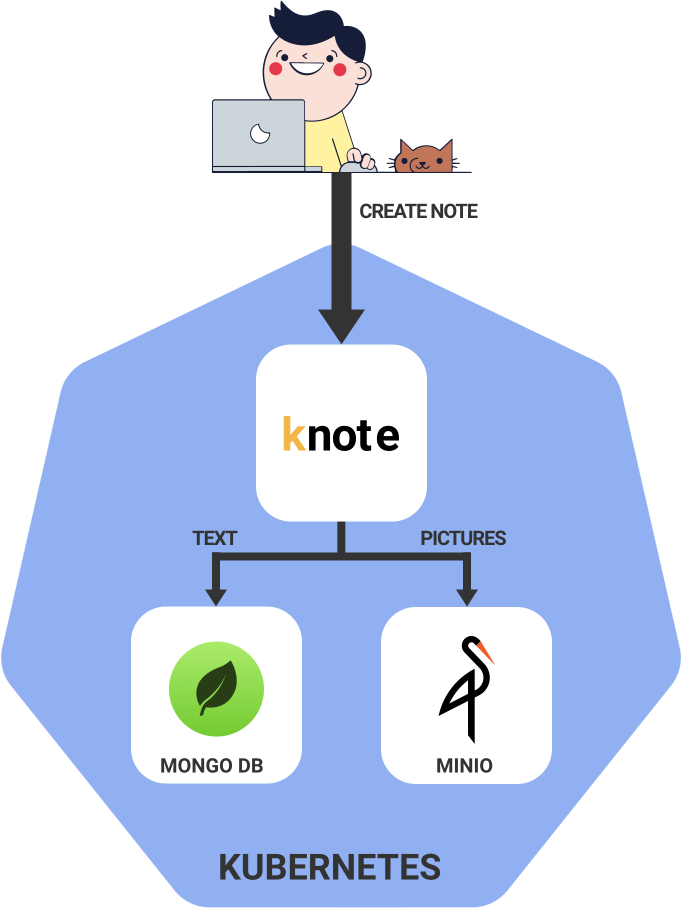

**TL;DR:** In this chapter, you'll learn how to scale your Node.js application with Kubernetes by making it stateless.

Kubernetes is all about making your applications robust when traffic is high.

But, how do you actually do that?

Scaling.

If your application is popular and you receive more traffic than usual, you might need to increment the number of instances running to cope with the load.

And if the sudden increase in traffic vanishes after a few days, you might want to save resources in your infrastructure and decrease the unused instances.

Kubernetes is designed to help you scale up and down your applications so that you can handle different traffic patterns to your applications.

However, there's a gotcha.

Not all applications can be scaled out of the box.

If your application is holding any data in memory or on disk, you might not be able to scale it unless it's refactored to be stateless.

But don't worry, you will learn how to do it in this article.

The application which you'll learn to scale today is called Knote.

If you have been following along the tutorial series, you would have learnt to deploy this application in a cluster during [the previous chapter](https://learnk8s.io/deploying-nodejs-kubernetes).

This is what you'll be looking at today.

## Table of contents

1. [Scaling, high availability and resiliency](#scaling-high-availability-and-resiliency)
1. [The application](#the-application)
1. [Scaling and statefulness](#scaling-and-statefulness)
1. [Making the app stateless](#making-the-app-stateless)
1. [Defining the MinIO component](#defining-the-minio-component)
1. [Deploying the app](#deploying-the-app)
1. [Scaling the app](#scaling-the-app)

## Scaling, high availability and resiliency

Scaling means increasing or decreasing the number of instances of an application component.

You could scale your app to 2, 3, or 10 copies.

The benefits of this are twofold:

- **High availability:** if one of the instances crashes, there are still other replicas running that can handle incoming requests.
- **Resiliency:** the total traffic to your application is distributed between all the replicas. Thus, the risk of overload of a single Pod is reduced.

But not all apps can be scaled horizontally.

If your application has any local state, you might need to refactor the code to remove it.

In this section, you will learn how to scale your app to any number of replicas in Kubernetes.

And you will learn how to refactor your apps to externalise any local state.

## The application

The application that you will scale on Kubernetes is the following:


The application is made of two parts:

1. A front-end written in Node.js and Express.
1. A MongoDB to persist the data.

All the code to build and deploy the app is available [in this repository](https://github.com/learnk8s/knote-js/tree/master/04).

**If you deployed the application already, you should delete the previous deployment and start fresh.**

## Scaling and statefulness

First of all, deploy your application to your Minikube cluster and wait until all the Pods are ready:

```terminal|command=1|title=bash
kubectl apply -f kube
```

At the moment, there is one Pod running for the app and one for the database.

Kubernetes makes it very easy to increase the number of replicas to 2:

```terminal|command=1|title=bash
kubectl scale --replicas=2 deployment/knote
```

You can watch how a new Pod is created with:

```terminal|command=1|title=bash
kubectl get pods -l app=knote --watch
```

> The `-l` flag is an alias for the `--selector` flag.  With this flag, we only select the Pods with the `app=knote` label.

There are now two replicas of the Knote Pod running.

_So, are you already done?_

Reaccess your app:

```terminal|command=1|title=bash
minikube service knote --url
```

And create a note with a picture.

Now try to reload your app a couple of times (i.e. hit your browser's reload button).

_Did you notice any glitch?_

**The picture that you added to your note is not displayed on every reload.**

If you pay attention, the picture is only displayed on every second reload, on average.

_Why is that?_

Remember that your application saves uploaded pictures in the local file system.

If your app runs in a container, the pictures are saved only within that container's file system.

When you had only a single Pod, this was fine.

But since you have two replicas, there's an issue.

The picture that you previously uploaded is saved in only one of the two Pods.

When you access your app, the `knote` Service selects one of the available Pods.

When it selects the Pod that has the picture in its file system, the image is displayed.

But when it selects the other Pod, the picture isn't displayed, because the container doesn't have it.

```animation
{
  "description": "Uploading files inside the app makes it stateful",
  "animation": "assets/stateful.svg",
  "fallback": "assets/stateful-fallback.svg"
}
```

**Your application is stateful.**

The pictures in the local filesystem constitute a state that is local to each container.

**To be scalable, applications must be stateless.**

Stateless means that an instance can be killed restarted or duplicated at any time without any data loss or inconsistent behaviour.

_You must make your app stateless before you can scale it._

In this section, you will refactor your app to make it stateless.

**But before you proceed, remove your current application from the cluster:**

```terminal|command=1|title=bash
kubectl delete -f kube
```

The command ensures that the old data in the database's persistent volume does not stick around.

## Making the app stateless

_How can you make your application stateless?_

The challenge is that uploaded pictures are saved in the container's file system where they can be accessed only by the current Pod.

However, you could save the pictures in a central place where all Pods can access them.

**An object storage is an ideal system to store files centrally.**

You could use a cloud solution, such as [Amazon S3](https://aws.amazon.com/s3/).

But to hone your Kubernetes skills, you could deploy an object storage service yourself.

[MinIO](https://github.com/minio/minio) is an open-source object storage service that can be installed on your infrastructure.

And you can install MinIO in your Kubernetes cluster.

In the next step you should refactor your app to include MinIO.

The architecture of your app looks like this:



It consists of three components:

1. Knote as the primary application for creating notes
1. MongoDB for storing the text of the notes, and
1. MinIO for storing the pictures of the notes.

Only the Knote component is accessible from outside the cluster — the MongoDB and MinIO components are hidden inside.

For convenience, the following image is already packaged with the code changes `learnk8s/knote-js:2.0.0`.

You don't have to change the code, the new container image already supports MinIO.

> If you're interested, you can find the final source code file [in this repository](https://github.com/learnk8s/knote-js/tree/master/04-05).

The new application expect three more variables:

1. The `MINIO_HOST` — this corresponds to the name fo the MinIO container.
1. `MINIO_ACCESS_KEY` — the key to access the MinIO bucket.
1. `MINIO_SECRET_KEY` — the secret that you need to present alongside the key to authenticate with MinIO.

## Updating the Knote configuration

If you want to deploy the new version of your app to Kubernetes, you have to do a few changes to the YAML resources.

In particular, you have to update the Docker image name and add the additional environment variables in the Deployment resource.

You should change the Deployment resource in your `knote.yaml` file as follows (changed lines are highlighted):

```yaml|highlight=17,23-28|title=kube/knote.yaml
apiVersion: apps/v1
kind: Deployment
metadata:
  name: knote
spec:
  replicas: 1
  selector:
    matchLabels:
      app: knote
  template:
    metadata:
      labels:
        app: knote
    spec:
      containers:
        - name: knote
          image: learnk8s/knote-js:2.0.0
          ports:
            - containerPort: 3000
          env:
            - name: MONGO_URL
              value: mongodb://mongo:27017/dev
            - name: MINIO_ACCESS_KEY
              value: mykey
            - name: MINIO_SECRET_KEY
              value: mysecret
            - name: MINIO_HOST
              value: minio
          imagePullPolicy: Always
```

> Please note that the command runs the `learnk8s/knote-js:2.0.0` image.

However, there is still something missing.

You should create a Kubernetes resource definition for the new MinIO component.

_So, let's do it._

## Defining the MinIO component

The task at hand is to deploy MinIO to a Kubernetes cluster.

You should be able to guess what the Kubernetes description for MinIO looks like.

**It should look like the MongoDB description that you defined in the ["Deploying to Kubernetes" section](https://learnk8s.io/deploying-nodejs-kubernetes#defining-the-database-tier).**

Just like MongoDB, MinIO requires the following:

- Persistent storage
- Be accessible to other Pods inside the cluster by using a Service

Here's the complete MinIO configuration to be saved in `kube/minio.yaml`:

```yaml|title=kube/minio.yaml
apiVersion: v1
kind: PersistentVolumeClaim
metadata:
  name: minio-pvc
spec:
  accessModes:
    - ReadWriteOnce
  resources:
    requests:
      storage: 256Mi
---
apiVersion: v1
kind: Service
metadata:
  name: minio
spec:
  selector:
    app: minio
  ports:
    - port: 9000
      targetPort: 9000
---
apiVersion: apps/v1
kind: Deployment
metadata:
  name: minio
spec:
  strategy:
    type: Recreate
  selector:
    matchLabels:
      app: minio
  template:
    metadata:
      labels:
        app: minio
    spec:
      containers:
        - name: minio
          image: minio/minio:RELEASE.2020-03-14T02-21-58Z
          args:
            - server
            - /storage
          env:
            - name: MINIO_ACCESS_KEY
              value: mykey
            - name: MINIO_SECRET_KEY
              value: mysecret
          ports:
            - containerPort: 9000
          volumeMounts:
            - name: storage
              mountPath: /storage
      volumes:
        - name: storage
          persistentVolumeClaim:
            claimName: minio-pvc
```

Just like the YAML file `kube/mongo.yaml`, this file also has a Deployment, Service and PersistenVolumeClaim resource definition.

The same concepts and understanding can be applied here.

With that, you just defined the last of the three components of your application.

Your Kubernetes configuration is now complete.

_It's time to deploy the application!_

## Deploying the app

**Now comes the big moment!**

You will deploy the new version of your app to Kubernetes.

First of all, make sure that you have the following three YAML files in the `kube` directory:

```terminal|command=1|title=bash
tree .
kube/
├── knote.yaml
├── minio.yaml
└── mongo.yaml
```

Also, make sure that you deleted the previous version of the app from the cluster:

```terminal|command=1|title=bash
kubectl get pods
```

The command shouldn't output any resources.

> Deleting the previous version of the app makes sure that the old data in the MongoDB database is removed.

Now deploy your app to Kubernetes:

```terminal|command=1|title=bash
kubectl apply -f kube
```

Watch your Pods being created:

```terminal|command=1|title=bash
kubectl get pods --watch
```

You should see three Pods.

Once all three Pods are _Running_, your application is ready.

Access your app with:

```terminal|command=1|title=bash
minikube service knote --url
```

The command should open your app in a web browser.

Verify that it works correctly by creating some notes with pictures.

**It should work as expected!**

As a summary, here is what your application looks like now:


It consists of three components:

1. Knote as the primary application for creating notes
1. MongoDB for storing the text of the notes, and
1. MinIO for storing the pictures of the notes.

Only the Knote component is accessible from outside the cluster — the MongoDB and MinIO components are hidden inside.

_At the moment, you're running a single Knote container._

But the topic of this section is "scaling".

_So, let's scale it!_

## Scaling the app

Your app is now stateless because it saves the uploaded pictures on a MinIO server instead of the Pod's file system.

_In other words, when you scale your app, all pictures should appear on every request._

**It's the moment of truth.**

Scale the Knote container to 10 replicas:

```terminal|command=1|title=bash
kubectl scale --replicas=10 deployment/knote
```

There should be nine additional Knote Pods being created.

You can watch them come online with:

```terminal|command=1|title=bash
kubectl get pods -l app=knote --watch
```

After a short moment, the new Pods should all be _Running_.

Go back to your app in the web browser and reload the page a couple of times.

_Are the pictures always displayed?_

**Yes they are!**

Thanks to statelessness, your Pods can now be scaled to any number of replicas without any data loss or inconsistent behaviour.

_You just created a scalable app!_

When you're done playing with your app, delete it from the cluster with:

```terminal|command=1|title=bash
kubectl delete -f kube
```

And stop Minikube with:

```terminal|command=1|title=bash
minikube stop
```

You don't need Minikube anymore.

## Recap and next steps

In this section, you learned how to refactor an app and make it scalable with Kubernetes.

Here's a racap of what you learned:

1. You scaled the application to two instances and noticed that it was stateful.
1. You refactored the app and externalised the state using an object store — MinIO.
1. You deployed MinIO in the cluster with persistent storage.
1. You redeploy the application with the changes.
1. You scaled the application again and verified that it's stateless. 

[In the next section, you will create a new Kubernetes cluster in the cloud and deploy your app there!](https://learnk8s.io/deploying-nodejs-kubernetes-eks)
