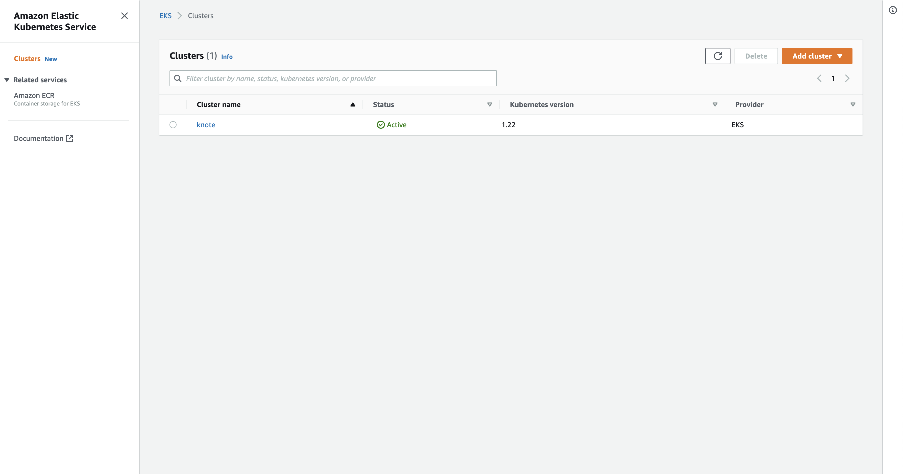

**TL;DR:** In this chapter, you'll create a production-grade Kubernetes cluster on [AWS using Amazon Elastic Kubernetes Service (EKS)](https://aws.amazon.com/eks/), and you will deploy your application to it.

EKS is a managed Kubernetes service, which means that Amazon Web Services (AWS) is fully responsible for managing the control plane.

In particular, AWS:

- Manages Kubernetes API servers and the etcd database.
- Runs the Kubernetes control plane across three availability zones.
- Scales the control-plane as you add more nodes to your cluster.
- Provides a mechanism to upgrade your control plane to a newer version.
- Rotates certificates.
- [And more](https://aws.amazon.com/eks/?whats-new-cards.sort-by=item.additionalFields.postDateTime&whats-new-cards.sort-order=desc&eks-blogs.sort-by=item.additionalFields.createdDate&eks-blogs.sort-order=desc).

Less timing managing the cluster means that you have more time to focus on developing and deploying applications.

In this article, you will create an EKS cluster and deploy a Node.js application called Knote — a simple note-taking application.

The application comes packaged as a Docker container already.

If it peaks your interest, you can also [learn how to package or test your deplyoment into a local Kubernetes cluster](https://learnk8s.io/deploying-nodejs-kubernetes).

Here's everything you'll look at today.

## Table of contents

1. [Logging into Amazon Web Services](#logging-into-amazon-web-services)
1. [Creating a Kubernetes cluster on AWS](#creating-a-kubernetes-cluster-on-aws)
1. [Deploying the app](#deploying-the-app)
1. [Taking into account resource limits](#taking-into-account-resource-limits)
1. [Cleaning up](#cleaning-up)

## Logging into Amazon Web Services

To use Amazon Web Services (AWS), you need an AWS account.

_If you already have an AWS account, you can [jump to the next section →](#creating-a-kubernetes-cluster-on-aws)_

The first step is [signing up for an AWS account](https://aws.amazon.com/).

> Note that to create any resources on AWS, you have to provide valid credit card details.

Next, you should create an AWS access key — this is necessary to access AWS services from the command line.

To do so, follow these instructions:

```slideshow
{
  "description": "How to find your AWS Access Key and Secret Access Key",
  "slides": [
    {
      "image": "assets/sign-in.png",
      "description": "[Log in to your AWS Management Console](https://console.aws.amazon.com/console/home)."
    },
    {
      "image": "assets/console-welcome.jpg",
      "description": "You should see your AWS console once you're logged in."
    },
    {
      "image": "assets/console-welcome-select.jpg",
      "description": "Click on your user name at the top right of the page."
    },
    {
      "image": "assets/console-dropdown.jpg",
      "description": "In the drop down there's an item for \"My Security Credentials\"."
    },
    {
      "image": "assets/console-dropdown-select.jpg",
      "description": "Click on \"My Security Credentials\"."
    },
    {
      "image": "assets/security-credentials-welcome.jpg",
      "description": "You should land on Your Security Credentials page."
    },
    {
      "image": "assets/security-credentials-welcome-select.jpg",
      "description": "Click on Access Keys."
    },
    {
      "image": "assets/create-key.jpg",
      "description": "The accordion unfolds the list of active keys (if any) and a button to create a new access key."
    },
    {
      "image": "assets/create-key-select.jpg",
      "description": "Click on \"Create New Access Key\"."
    },
    {
      "image": "assets/modal-create.jpg",
      "description": "A modal window appears suggesting that the key was created successfully."
    },
    {
      "image": "assets/modal-create-click.jpg",
      "description": "Click on \"Show Access Key\" to reveal the access key."
    },
    {
      "image": "assets/dialog-show-keys.jpg",
      "description": "You should see your access and secret key."
    },
    {
      "image": "assets/dialog-show-keys-select.jpg",
      "description": "Please make a note of your keys as you will need those values in the next step."
    }
  ]
}
```

You should save the access key ID and secret access key in a file named `~/.aws/credentials` as follows:

```title=$HOME/.aws/credentials
[default]
aws_access_key_id=[access-key-id]
aws_secret_access_key=[secret-access-key]
```

_Remember to include the `[default]` in the file!_

Now, you can [install the aws-cli](https://github.com/aws/aws-cli)

```terminal|command=1|title=bash
sudo python -m pip install awscli
```


If you are authenticated, when you run the command below, you should get a valid response as such if you have not created any clusters before.

```terminal|command=1|title=bash
aws eks list-clusters --region=us-east-1

{
    "clusters": []
}
```

_That's it! You're an AWS user now._

## Creating a Kubernetes cluster on AWS

You will use [Amazon Elastic Kubernetes Service (EKS)](https://aws.amazon.com/eks/) for creating a Kubernetes cluster on AWS.

Amazon EKS is the managed Kubernetes service of AWS — it is comparable to [Azure Kubernetes Service (AKS)](https://docs.microsoft.com/en-us/azure/aks/) or [Google Kubernetes Engine (GKE)](https://cloud.google.com/kubernetes-engine/).

> **Caution:** AWS isn't free, and the resources that you will create in this section will produce **very reasonable charges** on your credit card.

In practice, the total costs will be around **USD 0.20 per hour**.

In other words, using the cluster for 5 hours will set you back around 1 dollars.

You will create the cluster with a tool called [eksctl](https://github.com/weaveworks/eksctl) — a third-party command-line tool that allows creating an EKS cluster with a single command.

You can install eksctl according to the instructions in [the official project page](https://github.com/weaveworks/eksctl#usage).

_With eksctl installed, it's time to create an Amazon EKS cluster._

Run the following eksctl command:

```terminal|command=1|title=bash
eksctl create cluster --region=eu-west-2 --name=knote
```

The command creates an Amazon EKS Kubernetes cluster with the following properties:

- Two worker nodes (this is the default)
- The worker nodes are [`m5.large` Amazon EC2 instances](https://aws.amazon.com/ec2/instance-types/) (this is the default)
- The cluster is created in the eu-west-2 region (London)
- The name of the cluster is `knote`

> You can use any other AWS region [where Amazon EKS is available](https://gist.github.com/weibeld/a0856c16b156f357ac7738d4bef155ee).

_Please be patient! Creating an EKS cluster usually takes around 15 minutes._

**While you wait for the cluster being created, you have some time to think about Amazon EKS.**

Amazon EKS is a managed Kubernetes service, in the sense that AWS runs the Kubernetes control plane for you.

That means, AWS runs the master nodes, and you run the worker nodes.

AWS runs three master nodes in three availability zones in your selected region.

```slideshow
{
  "description": "EKS multi-master setup",
  "slides": [
    {
      "image": "assets/eks-1.svg",
      "description": "Amazon Elastic Kubernetes Service (EKS) is the managed Kubernetes offering of AWS. It allows you to create a resilient Kubernetes cluster running on the AWS infrastructure."
    },
    {
      "image": "assets/eks-2.svg",
      "description": "AWS creates three master nodes. The three master nodes are deployed in three different availability zones."
    },
    {
      "image": "assets/eks-3.svg",
      "description": "An Application Load Balancer (ALB) distributes the traffic to the three API servers on the master nodes."
    },
    {
      "image": "assets/eks-4.svg",
      "description": "There are also three etcd instances. They sync between themselves. Even if one availability zone is lost, the cluster can still operate correctly."
    },
    {
      "image": "assets/eks-5.svg",
      "description": "There are also three etcd instances. They sync between themselves. Even if one availability zone is lost, the cluster can still operate correctly."
    }
  ]
}
```

_You have no access to the master nodes._

But you have full control over the worker nodes.

The worker nodes are ordinary Amazon EC2 instances in your AWS account.

_Once the eksctl command completes Amazon EKS cluster should be ready!_

You can list the two worker nodes of your cluster with:

```terminal|command=1|title=bash
kubectl get nodes
NAME                                           STATUS   ROLES    AGE   VERSION
ip-192-168-25-57.eu-west-2.compute.internal    Ready    <none>   23m   v1.12.7
ip-192-168-68-152.eu-west-2.compute.internal   Ready    <none>   23m   v1.12.7
```

> Note that you can't list or inspect the master nodes in any way with Amazon EKS. AWS fully manages the master nodes, and you don't need to be concerned about them.

Since the worker nodes are regular Amazon EC2 instances in your AWS account, you can inspect them in the [AWS EC2 Console](https://eu-west-2.console.aws.amazon.com/ec2/v2/home?region=eu-west-2#Instances).

You can also inspect the Amazon EKS resource itself in your AWS account in the [AWS EKS Console](https://eu-west-2.console.aws.amazon.com/eks/home?region=eu-west-2#/clusters).



As you can see, your Amazon EKS cluster has further related resources — they handle all the aspects that are required for a production-grade cluster such as networking, access control, security, and logging.

Those resources are created by eksctl.

> eksctl creates a [CloudFormation](https://eu-west-2.console.aws.amazon.com/cloudformation/home) stack with all resources belonging to your Amazon EKS cluster.

**You have a production-grade Kubernetes cluster on AWS now.**

_It's time to deploy the application._

## Deploying the app

The application that you will deploy on Kubernetes is the following:


The application is made of two parts:

1. A front-end written in Node.js and Express.
1. A MongoDB to persist the data.

Before we continue, here are the links to the previous chapters of this series:
- If you want to learn how to develop and package the application in a Docker container, [refer to this chapter of the course.](https://learnk8s.io/developing-and-packaging-nodejs-docker)
- If you need help to set up a local Kubernetes cluster or deploy the application on Kubernetes, [refer to this other chapter.](https://learnk8s.io/deploying-nodejs-kubernetes)
- If you want to know how this app was refactored to scale horizontally, [refer to this chapter instead.](https://learnk8s.io/scaling-nodejs-kubernetes)

All the code to build and deploy the app is available [in this repository](https://github.com/learnk8s/knote-js/tree/master/05).

The code contains the YAML Kubernetes definitions for Deployments and Services for minikube.

_Do these YAML resource definitions still work on Amazon EKS without any changes?_

It's time to find out.

First of all, make sure that you have the three YAML files in the `kube` directory:

```terminal|command=1|title=bash
tree .
kube/
├── knote.yaml
├── minio.yaml
└── mongo.yaml
```

> Note that, if you've completed the previous chapter in this course, these are precisely the same YAML files that you deployed to the Minikube cluster.

Next, submit your configuration to the new Amazon EKS cluster:

```terminal|command=1|title=bash
kubectl apply -f kube
```

Watch the Pods being created:

```terminal|command=1|title=bash
kubectl get pods --watch
```

_The app seems to be running now._

To access the app, you need the public address of the `knote` Service.

You can get it with this command:

```terminal|command=1|title=bash
kubectl get service knote
NAME  TYPE         CLUSTER-IP    EXTERNAL-IP                        PORT(S)
knote LoadBalancer 10.100.188.43 <xxx.eu-west-2.elb.amazonaws.com>  80:31373/TCP
```

The `EXTERNAL-IP` column should contain a fully-qualified domain name.

_The address allows you to access the app from anywhere._

Open the domain name in your web browser.

> Note that it may take a couple of minutes until AWS DNS resolution is set up. If you get an `ERR_NAME_NOT_RESOLVED` error, try again in a few minutes.

**You should see your app!**

Verify that the app works as expected by creating some notes with pictures.

_Everything should work correctly._

So, your hopes came true — you can deploy the same configuration to Amazon EKS!

_And everything should work the same if you want to deploy it to Azure Kubernetes Service or Google Kubernetes Engine._

_But what about scaling?_

Go ahead and scale your Knote container to 10 replicas:

```terminal|command=1|title=bash
kubectl scale --replicas=10 deployment knote
```

And check if everything still works by creating some more notes with pictures and reloading the page a couple of times.

_Everything should indeed work as it did before._

**You just discovered the beauty of Kubernetes: you can define an application once and run it on any Kubernetes cluster.**

## Taking into account resource limits

There is something else that you should know about scaling Pods.

The number of Pods running in a given cluster is not unlimited.

**In particular, there are limits on the maximum number of Pods that can run on a node.**

On Amazon EKS, these limits depend on the EC2 instance type that you select.

**Larger instances can host more Pods than smaller instances.**

The details are described in the [`eni-max-pods.txt`](https://github.com/awslabs/amazon-eks-ami/blob/master/files/eni-max-pods.txt) document from AWS.

This document defines the maximum number of Pods that can be run on each Amazon EC2 instance type.

The `m5.large` instance type that you are using for your worker nodes can host up to 29 Pods.

**You have two worker nodes in your cluster — that means you can run up to 58 Pods in your cluster.**

_So, what happens when you scale your Pods to 100 replicas?_

The replicas that exceed the limit of 58 Pods should be stuck in the _Pending_ state and never run.

Because no node can run them.

_Let's test this._

First, check how many Pods are running in your cluster right now:

```terminal|command=1|title=bash
kubectl get pods --all-namespaces
```

You should see 9 Pods — the 3 Pods that are part of your application (`minio`, `mongo` and `knote`) and 6 system Pods.

> Kubernetes runs some system Pods on your worker nodes in the `kube-system` namespace. These Pods count against the limit too. The `--all-namespaces` flag outputs the Pods from all namespaces of the cluster.

_So, how many replicas of the `knote` Pod can you run in the cluster?_

Let's do some math.

58 is the maximum number of Pods that can run in the cluster. 

You have: 
- 6 system pods
- 1 pod for `minio`
- 1 pod for `mongo`

That means that you can have **up to 50 replicas** of the `knote` Pod.

_Let's exceed this limit on purpose to observe what happens._

Scale your Knote app to 60 replicas:

```terminal|command=1|title=bash
kubectl scale --replicas=60 deployment/knote
```

Wait for the Pods to start up.

_If your calculations were correct, only 50 of these 60 replicas should be running in the cluster — the remaining ten should be stuck in the Pending state._

Let's start by counting the Knote Pods that are _Running_:

```terminal|command=1-4|title=bash
kubectl get pods \
  -l app=knote \
  --field-selector='status.phase=Running' \
  --no-headers | wc -l
```

The command should output 50.

And now the Knote Pods that are _Pending_:

```terminal|command=1-4|title=bash
kubectl get pods \
  -l app=knote \
  --field-selector='status.phase=Pending' \
  --no-headers | wc -l
```

The command should output 10.

**So your calculations were correct.**

50 of the 60 replicas are _Running_ — the remaining 10 are _Pending_.

The ten pending replicas can't run because the maximum number of 58 running Pods in the cluster has been reached.

You can verify that there are indeed 58 running Pods in the cluster with:

```terminal|command=1-4|title=bash
kubectl get pods \
  --all-namespaces \
  --field-selector='status.phase=Running' \
  --no-headers | wc -l
```

The command should output 58.

To fix the issue, you can scale down the number of replicas to 50:

```terminal|command=1|title=bash
kubectl scale --replicas=50 deployment/knote
```

After a while, you should see no _Pending_ Pods anymore — all the replicas should be running.

**But what if you want a higher number of replicas at all costs?**

You could add more nodes to your cluster.

Nothing prevents you from creating a cluster with 10, 20, 30, or 1000 worker nodes.

> Kubernetes is tested to run reliably with up to [several thousands of nodes and tens of thousands of Pods](https://kubernetes.io/docs/setup/best-practices/cluster-large/).

Or you could use larger EC2 instances that can host more Pods (see [AWS limits](https://github.com/awslabs/amazon-eks-ami/blob/master/files/eni-max-pods.txt)).

Nothing prevents you from using `m5.24xlarge` EC2 instances for your worker nodes and have 737 Pods on each of them.

**Whatever your scaling requirements are, Kubernetes can accommodate them — you just have to design your cluster accordingly.**

## Cleaning up

_Before you leave, you should remember something important:_

**Running an Amazon EKS cluster is not free.**

Running the cluster alone (without the worker nodes) [costs USD 0.20 per hour](https://aws.amazon.com/eks/pricing/).

> The price stays the same, no matter how many Pods you run on the cluster.

And running the two `m5.large` worker node [costs USD 0.096 per hour](https://aws.amazon.com/ec2/pricing/on-demand/) for each one.

**The total amount is around USD 0.40 per hour for running your cluster.**

While it might not seem a lot, if you forget to delete your cluster, it could add up quickly.

**That's why you should always delete your Amazon EKS cluster when you don't need it anymore.**

You can do this conveniently with eksctl:

```terminal|command=1|title=bash
eksctl delete cluster --region=eu-west-2 --name=knote
```

The command deletes all AWS resources that belong to your Amazon EKS cluster.

After the command completes, you can double-check that the AWS resources have been deleted in the AWS Console:

- [Check the AWS EKS Console](https://console.aws.amazon.com/eks/home) and verify that the Amazon EKS cluster resource has been removed (or is being deleted)
- [Check the AWS EC2 Console](https://console.aws.amazon.com/ec2/v2/home?#Instances) and confirm that the EC2 instances that were your worker nodes have been removed (or are being deleted)

> When you access the AWS Console, always double-check that you selected the correct region in the top-right corner (e.g. London). If you are in the wrong region, you can't see the resources from another region.

If you want to work with your cluster again at a later time, you can repeat the same steps:

1. Create a new cluster with eksctl
1. Deploy your app
1. Delete the cluster with eksctl

## Conclusion

**You've reached the end of this crash course on Kubernetes.**

Let's recap what you achieved:

- You wrote a note-taking application in Node.js
- You packaged the app as a Docker image
- You deployed the containerised application to a local Minikube cluster
- You refactored your application to make it stateless and scalable
- You deployed the improved application to a production-grade Kubernetes cluster on AWS

In the course of this, you learnt about many topics, including:

- Taking Kubernetes considerations into account as early as coding an application
- How to build Docker images and upload them to Docker Hub
- How to run a containerised application locally in a Docker network
- How to create a local Kubernetes cluster with Minikube
- The declarative resource-based interface of Kubernetes
- Where you can find information about Kubernetes resource objects
- How to write application deployment configurations for Kubernetes
- How statefulness is related to scalability
- How to scale an application on Kubernetes
- How to create a production-grade Kubernetes cluster on AWS using Amazon EKS
- Taking into account resource limits on production Kubernetes clusters

## Where to go from here?

If you want to keep experimenting, you can create a Kubernetes cluster with a different provider, such as [Google Kubernetes Engine (GKE)](https://cloud.google.com/kubernetes-engine/) or [Azure Kubernetes Service (AKS)](https://docs.microsoft.com/en-us/azure/aks/) and deploy your application there.

Since a Kubernetes deployment configuration, once defined, can be deployed to every Kubernetes cluster, you should have no troubles with that.

During this course, you covered several topics, but you didn't have the time to study them in-depth.

An obvious place to learn more about Kubernetes is in the [official documentation](https://kubernetes.io/docs/home/) where you can find more about fundamental [concepts](https://kubernetes.io/docs/concepts/), [everyday tasks](https://kubernetes.io/docs/tasks/), or even learn how to [install Kubernetes from scratch](https://kubernetes.io/docs/setup/).

Finally, the [Learnk8s Academy](https://academy.learnk8s.io) offers a broad range of Kubernetes courses, similar to the one you completed.

These courses treat various topics in much more depth than this introductory course could provide.

The Learnk8s Academy courses can also prepare you for the [Certified Kubernetes Administrator (CKA)](https://www.cncf.io/certification/cka/) and [Certified Kubernetes Application Developer (CKAD)](https://www.cncf.io/certification/ckad/) exams.

**Happy navigating with Kubernetes!**
